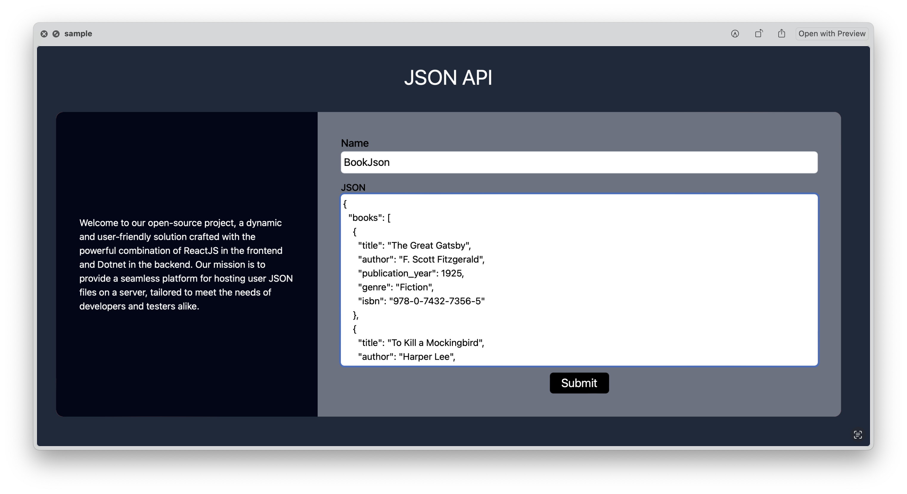

# JSON API
_Developed by Saurav Khanal and Rohan Paudel_

> [!NOTE]
> This project has been developed as an open-source initiative, designed to provide a platform for hosting user JSON files on a server, specifically tailored for development or testing endeavors.

## Introduction
Welcome to our open-source project, a dynamic and user-friendly solution crafted with the powerful combination of ReactJS in the frontend and Dotnet in the backend. Our mission is to provide a seamless platform for hosting user JSON files on a server, tailored to meet the needs of developers and testers alike.

## Key Features

- **Free for Everyone:** Our commitment to the community extends to offering this service free of charge for a lifetime. Enjoy unrestricted access and utilize the platform without any cost barriers.

- **No Hit Count Limits:** Enjoy the freedom of unlimited usage with no restrictions on hit counts. Use the platform without any limitations on the number of requests.

- **No Need to Sign In:** Experience hassle-free access with no mandatory sign-in requirements. Benefit from the service without the need for user authentication.


## Usage

> [!WARNING]
> To manage server memory and maintain low costs, older data may be deleted at any time. Please refrain from using this service for permanent storage solutions.

Engaging with our service is a straightforward process, and its adaptability makes it suitable for a myriad of applications. Explore the effortless ways you can make the most of our service:

### 1. Effortless JSON Hosting

Experience seamless JSON document hosting through our user-friendly web interface with just a few simple steps:
- Visit [https://json.paudelrohan.com.np](https://json.paudelrohan.com.np).
- Under the "Name" section, assign a name to your JSON document.
- Under the "JSON" section, paste the JSON content.
- Click the "Submit" button.

### 2. Retrieving API Data

Effortlessly retrieve data from the API with a straightforward:
- Make a GET request to the API endpoint at `https://json.paudelrohan.com.np/api/json/{name_of_your_json_document}`.

## Example

I named the JSON file 'BookJson' and uploaded it with details about various books. The content of the JSON file includes information on different books such as 'The Great Gatsby,' 'To Kill a Mockingbird,' '1984,' and 'The Hobbit.' This data has been successfully uploaded using the 'BookJson' file.

> [!TIP]
> Below is a screenshot of the completed task.



After I've uploaded my JSON file, named 'BookJson', I can easily retrieve the data. Simply make a GET request to the following API endpoint:

```plaintext
https://json.paudelrohan.com.np/api/json/BookJson
```

## How to Contribute

We welcome contributions from the community! Whether it's bug fixes, new features, or improvements, feel free to fork the repository, make your changes, and submit a pull request. Together, let's make this project even better!

Feel the freedom to explore and enhance your development and testing workflows with our project. Thank you for being a part of our community!
